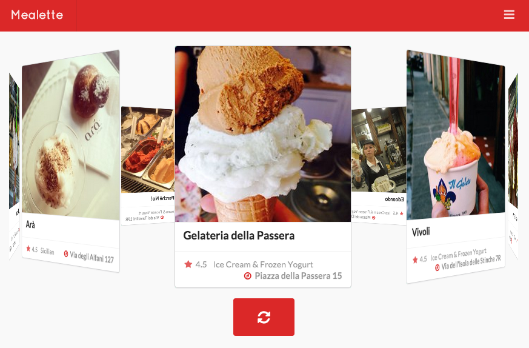
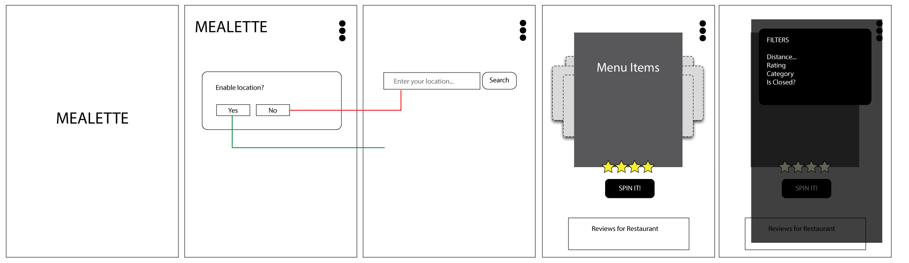

# Mealette
Mealette is a random restaurant generator for indecisive foodies. It uses a specified location and the Yelp API to generate a carousel of restaurants, which users can spin to receive a recommendation on where to eat.

Visit [http://mealette.herokuapp.com](http://mealette.herokuapp.com) to see the app in action. (Currently compatible on Google Chrome Browser and Android phones).



## Wireframe


## User Stories
As a user, I can...
```
* Enable or deny access to my current location
* Manually enter my location or another specified location
* View the ten closest restaurants to the entered location
* Repopulate the carousel with more nearby restaurants
* Swipe through the different restaurant options
* Filter restaurants by category
* Visit the restaurant's Yelp page
* Get directions to the restaurant through Google Maps
* Spin the carousel of restaurants
```

## Stretch Goals
As a user, I would like to...
```
* Filter restaurants by distance
* Filter restaurants by top rated
* Filter restaurants by open/closed
* Filter restaurants by price
* Filter restaurants by Yelp deals
* Filter restaurants by reservations accepted
* Make reservations if accepted by the restaurant
* Remove a restaurant from the carousel
```

## Challenges
```
* Lack of menu data on the Yelp API and access to other APIs with this information required the team to pivot the original idea from a random menu item generator to a random restaurant generator
* Time restraints prevented us from creating this idea as a downloadable mobile app
* Learning ReactJS so we could expose ourselves to new technologies and create a decoupled app
```

## Future Goals
```
* Transform this web app into a mobile app, compatible on both Android and iOS phones using PhoneGap
* Use a scraper, such as Kimono, to gather more restaurant details not provided by the Yelp API for additional filters
```

## Resources
```
* Rails API
* Yelp API
* Google Maps API
* Webpack
* ReactJS
* jQuery
* Semantic UI
```
